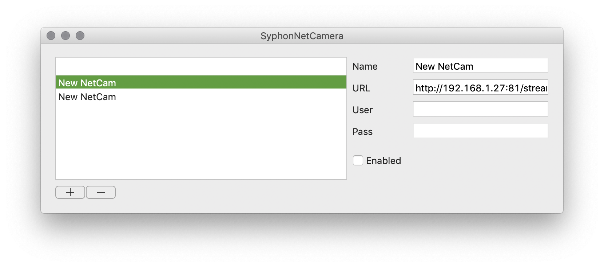
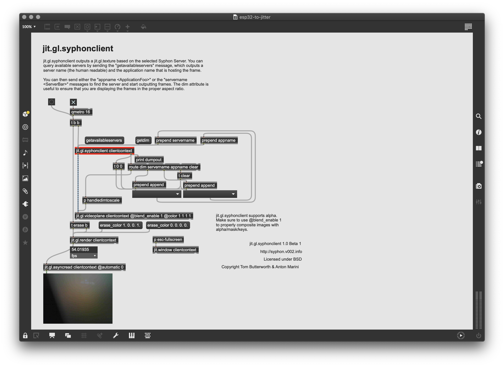

# ip-mjpeg-video-feed-to-jitter

## Import Internet camara feed (mjpeg) into jit.pwindow  
### *Mac OS only*

## Steps
1. Download syphon-camera: https://code.google.com/archive/p/syphon-camera/downloads
2. Open Syphon Net Camera, enter http address of mjpeg stream (if using TTGO Camera see https://foxdeniot.github.io/camera-2019/#mjpeg-stream).
  
3. Open ip-cam-to-jitter.maxpat

4. Viola! whatever your camera sees is in a jit.pwindow.
  

## Footnote
Install Syphon Library for MAX-MSP 
1. Download latest version https://github.com/Syphon/Jitter/releases/
2. Move Folder `Syphon` to `~/Documents/Max [version]/Packages/`.
